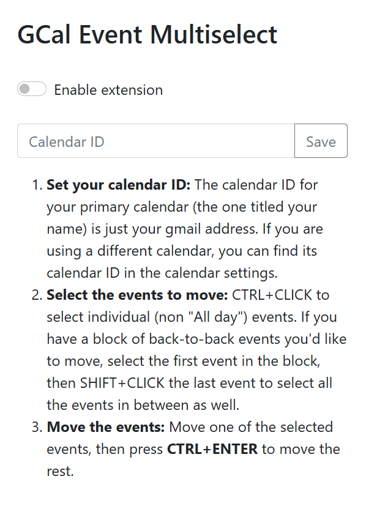

# Google Calendar Event Multiselect

## Demos:
* [Chrome Web Store listing](https://chromewebstore.google.com/detail/google-calendar-event-mul/eocpakpdohecpcnfjmgohbkkcdeedhfo)
* [YouTube video](https://www.youtube.com/watch?v=FStZ2e6FwVU)

## Objective:
Hello! This is my first shipped project ever, yay! I made it for people who use Google Calendar for time boxing.

I usually have my whole schedule for the day planned out, but when some delay happens (whoops), I'd need to shift all the rest of the day's events backwards. Adjusting each event's timing individually is very tedious to do if there are many events to move.

I also have recurring events in my daily schedule, but if I want to break from the schedule for a day, I'd need to delete all the scheduled events one by one.

This extension saves a lot of time because you can select multiple events and move/delete them all at once!

## How to set up and use this:
1. Install the extension from the [Chrome Web Store](https://chromewebstore.google.com/detail/google-calendar-event-mul/eocpakpdohecpcnfjmgohbkkcdeedhfo).
2. Go to calendar.google.com and click the extension icon to open the popup.
3. **Add and select your calendar in the extension popup:** The calendar ID for your primary calendar (the one titled your name) is just your gmail address. If you are using a different calendar, you can find its calendar ID in the calendar settings.
4. **Select the events to move or delete:** `CTRL/⌘ + CLICK` to select individual (non "All day") events. If you have a block of back-to-back events you'd like to move, select the first event in the block, then `SHIFT + CLICK` the last event to select all the events in between as well.
5.  
    * **Move the events:** Move one of the selected events, then press **`CTRL/⌘ + ENTER`** to move the rest.
    * **Delete the events:** Press **`CTRL/⌘ + DEL`** to delete all the selected events.

(Please be patient, it takes a while for the selection borders and event changes to appear.)

NOTE: The first time you select an event, a Google consent screen will appear for you to give the extension permission to access and edit your calendar events. Expand this for more info.

> 
>
> After choosing your account, you will see this warning, which is here because the extension makes use of the Google Calendar API's ".../auth/calendar.events" scope (permission to view and edit events on all your calendars). This is categorised as a sensitive scope as it grants access to private Google User Data, so I need to submit the extension for [verification](https://support.google.com/cloud/answer/13463073?sjid=13385238972695476127-NC) by Google. However, in order to get it verified, I need to submit a bunch of stuff, including an app homepage and privacy policy hosted on a domain I own, which I don't have... yet? 
>
> So for now, just click "Advanced" at the bottom, then click "Go to Google Calendar Event Multiselect (unsafe)".
>
> 
>
> 
>
> Now click "Continue" :-)
>
> 

### If you want to make your own version of this extension:
1. Go to https://github.com/faithlky/gcal-multiselect and download the gcal-multiselect folder and its contents on your computer. Then, go to chrome://extensions/ in Google Chrome and turn on Developer Mode at the top right. Click Load Unpacked and select the gcal-multiselect folder.
2. Delete the .crx and .pem files in the directory. Refer to https://stackoverflow.com/a/21500707 to generate new ones. In summary:
    * In Developer Mode on chrome://extensions/, click Pack Extension, select the extension's directory, leave the Private Key File field blank, and then Pack Extension. There should now be a new .crx file and a new .pem file in the directory.
    * Go to https://robwu.nl/crxviewer/, choose the .crx file, then Inspect to open the console. The public key is for step 6 and the extension ID is for step 5.
3. Go to console.cloud.google.com > Create a new project
4. "APIs & Services" > "Enabled APIs & Services" > Enable Google Calendar API
5. "OAuth Consent Screen" > "External" > "Create" > Fill in the required information > Add the scope .../auth/calendar.events > Add your test users
6. "Credientials" > "Create Credentials" > "OAuth client ID" > Application type: Chrome Extension; Item ID: (copy the extension ID from the CRX Viewer) > Copy the client ID
7. Replace "client_id" and "key" in manifest.json with your own client ID (from step 5) and public key (from step 1) respectively.

## Future improvements (maybe):
* ⭐ Support GCal in dark theme (since the borders that appear on selected events are currently black)
* Fetch the calendar name from its ID, rather than requiring user input
* It would be really nice if all the selected events would just shift together once one is shifted, without having to press Ctrl+Enter, but unfortunately, it seems like Google Calendar does something when events are dragged & dropped which prevents the dropping of events from registering as mouseups. I'd like to try and find an alternative solution if possible.
* Everything is kind of very slow... 🐌... Gotta try and fix that, though I'm not sure how I might approach this problem, since some of the lagginess might be due to the way Google Calendar updates the page.
